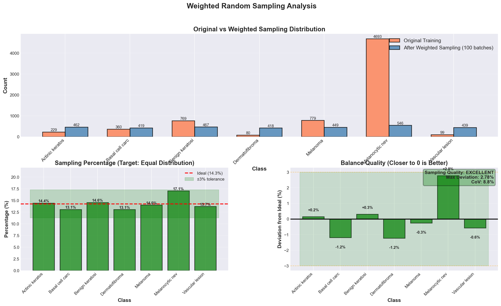
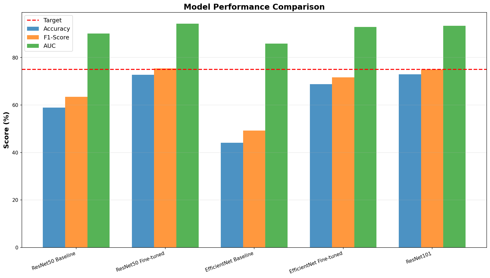
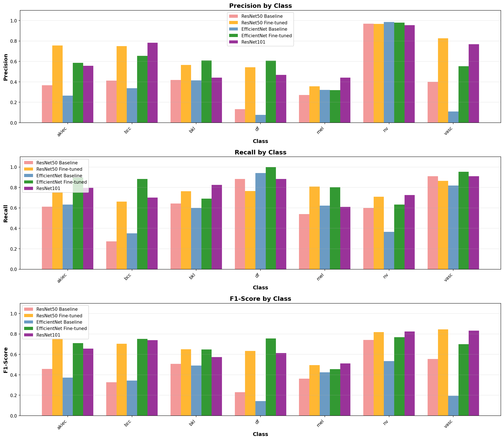
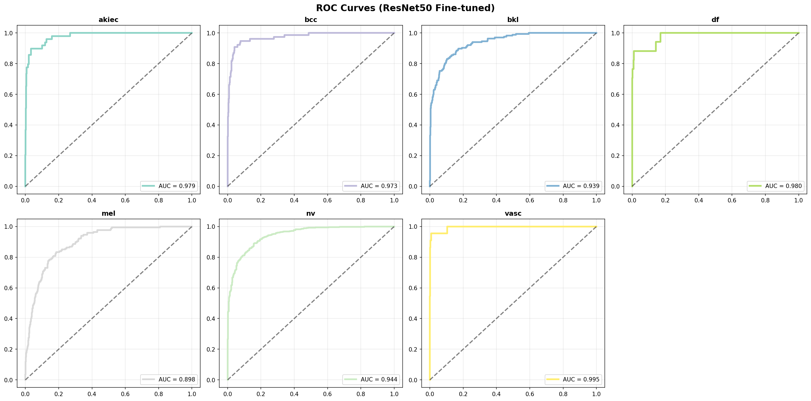

# 🏥 Skin Lesion Classification using Deep Learning

A transfer learning project that fine-tunes pre-trained CNNs (ResNet50, EfficientNet, ResNet101) to classify 7 types of skin lesions from the HAM10000 dataset.

## 📊 Project Overview

This project uses the HAM10000 dataset (10,015 skin lesion images) to train and compare different deep learning models for medical image classification.

### What the Model Can Detect:
- Actinic keratoses (akiec)
- Basal cell carcinoma (bcc)
- Benign keratosis (bkl)
- Dermatofibroma (df)
- Melanoma (mel)
- Melanocytic nevi (nv)
- Vascular lesions (vasc)

## 🎯 Results

| Model | Accuracy | F1-Score | AUC |
|-------|----------|----------|-----|
| ResNet50 Baseline | 58.5% | 63.7% | 91.1% |
| **ResNet50 Fine-tuned** | **72.2%** | **75.4%** | **94.3%** |
| EfficientNet Baseline | 44.0% | 48.5% | 87.1% |
| EfficientNet Fine-tuned | 69.1% | 72.2% | 95.3% |
| ResNet101 | 72.5% | 74.7% | 95.8% |

**Best Model:** ResNet50 Fine-tuned achieved 72.2% accuracy with strong performance across all skin lesion types.

## 🛠️ Technologies Used

- **Python** - Programming language
- **PyTorch** - Deep learning framework
- **torchvision** - Pre-trained models
- **NumPy & Pandas** - Data processing
- **Matplotlib & Seaborn** - Visualizations
- **scikit-learn** - Model evaluation

## 📁 Project Structure

```
skin-lesion-classifier/
│
├── data/
│   └── raw/
│       ├── HAM10000_images_part_1/
│       ├── HAM10000_images_part_2/
│       └── HAM10000_metadata.csv
│
├── models/
│   └── (saved trained models)
│
├── visualizations/
│   ├── overall_metrics_comparison.png
│   ├── per_class_performance.png
│   ├── roc_curves_by_class.png
│   └── weighted_sampling_analysis.png
│
├── medical_imaging.ipynb
└── README.md
```

## 🚀 Key Features

1. **Multiple Model Comparison** - Tested ResNet50, EfficientNet, and ResNet101
2. **Weighted Sampling** - Handled imbalanced dataset (melanocytic nevi was 46% of data)
3. **Data Augmentation** - Applied transformations to improve model generalization
4. **Comprehensive Metrics** - Evaluated using accuracy, precision, recall, F1-score, and AUC

## 📈 Model Performance Highlights
### Weighted Sampling


### Overall Performance


### Per-Class Analysis


### ROC Curves


## 🔧 How to Run

1. **Clone the repository**
```bash
git clone https://github.com/YOUR_USERNAME/skin-lesion-classifier.git
cd skin-lesion-classifier
```

2. **Install dependencies**
```bash
pip install torch torchvision numpy pandas matplotlib seaborn scikit-learn opencv-python pillow tqdm
```

3. **Download the HAM10000 dataset**
- Get it from [Harvard Dataverse](https://dataverse.harvard.edu/dataset.xhtml?persistentId=doi:10.7910/DVN/DBW86T)
- Place images in `data/raw/HAM10000_images_part_1/` and `data/raw/HAM10000_images_part_2/`
- Place metadata CSV in `data/raw/HAM10000_metadata.csv`

4. **Run the notebook**
```bash
jupyter notebook medical_imaging.ipynb
```

## 📚 What I Learned

- How to work with medical imaging datasets
- Dealing with imbalanced data using weighted sampling
- Comparing different CNN architectures (ResNet vs EfficientNet)
- Transfer learning and fine-tuning pre-trained models
- Evaluating models with multiple metrics (not just accuracy)

## 🎓 Dataset

This project uses the HAM10000 dataset:
- **Source:** [HAM10000 Dataset](https://dataverse.harvard.edu/dataset.xhtml?persistentId=doi:10.7910/DVN/DBW86T)
- **Paper:** Tschandl, P., Rosendahl, C. & Kittler, H. The HAM10000 dataset, a large collection of multi-source dermatoscopic images of common pigmented skin lesions. Sci Data 5, 180161 (2018).

## 💡 Future Improvements

- [ ] Implement ensemble methods combining best models
- [ ] Try more advanced architectures (Vision Transformers, EfficientNetV2)
- [ ] Add explainability with Grad-CAM to show what the model focuses on
- [ ] Deploy as a web app using Flask or Streamlit
- [ ] Collect more data for rare classes (dermatofibroma, vascular lesions)

## 📧 Contact

Feel free to reach out if you have questions or suggestions!

- GitHub: [PANG JING CHUAN @laofilin](https://github.com/laofilin/)
- LinkedIn: [Pang Jing Chuan](https://www.linkedin.com/in/pang-jing-chuan-b48a9315b/)
- Email: jingchuanpang@gmail.com

---

**Note:** This project is for educational purposes only and should not be used for actual medical diagnosis.
